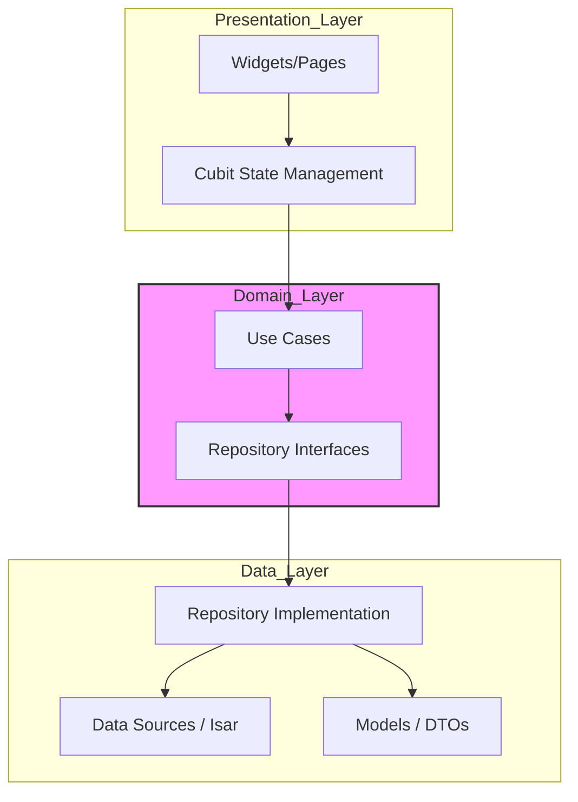

# Youmi (悠見)

[](https://flutter.dev)
[](https://dart.dev)
[](https://isar.dev)
[](https://opensource.org/licenses/MIT)

**Youmi** is a high-performance, offline-first personal productivity application designed for power users. Built with Flutter and Isar, it provides a seamless experience for managing tasks and notes with zero latency, ensuring your data remains private and accessible regardless of connectivity.

---

## 📸 Preview

| Dark Mode Dashboard | Note Management |
| :---: | :---: |
|  |  |
| *Productive overview of your day* | *Markdown-supported note taking* |

> [!NOTE]
> Screenshots above are placeholders. Replace them with actual application screenshots for production use.

---

## ✨ Features

- **Advanced Task Management**:
  - Intelligent filtering (Today, Weekly, Overdue).
  - Automated overdue handling and status synchronization.
  - Granular task lifecycle management.
- **Rich Note Taking**:
  - Full-text search powered by Isar's native indexing.
  - Pinning mechanism for critical information.
  - Markdown support for structured content.
- **Reminders & Notifications**:
  - Scheduled daily evening reminders for task review.
  - System-level notifications with custom scheduling logic.
- **Offline-First Excellence**:
  - ACID-compliant local persistence.
  - Instant startup and zero-latency interactions.
- **Personalization**:
  - Adaptive theme engine (Light/Dark/System).
  - Customizable notification preferences.

---

## 🛠 Tech Stack

| Category | Technology |
| :--- | :--- |
| **Framework** | [Flutter](https://flutter.dev) (SDK >= 3.2.0) |
| **Language** | [Dart](https://dart.dev) |
| **Database** | [Isar](https://isar.dev) (NoSQL) |
| **State Management** | [flutter_bloc](https://pub.dev/packages/flutter_bloc) (Cubit) |
| **Dependency Injection** | [get_it](https://pub.dev/packages/get_it) |
| **Navigation** | [go_router](https://pub.dev/packages/go_router) |
| **Local Notifications** | [flutter_local_notifications](https://pub.dev/packages/flutter_local_notifications) |

---

## 🏗 Architecture Overview

Youmi follows **Clean Architecture** principles with a **Feature-Driven** structure. This ensures high testability, maintainability, and clear separation of concerns.



### Core Design Principles
1. **Dependency Inversion**: High-level modules do not depend on low-level modules; both depend on abstractions.
2. **Single Responsibility**: Each class has one reason to change, from Use Cases to UI components.
3. **Immutability**: Leveraging Dart's immutable patterns for state and models to prevent side effects.

---

## 📂 Folder Structure

```text
lib/
├── core/               # Cross-cutting concerns (Theme, DI, Utils, Router)
│   ├── di/             # Service Locator (GetIt) configuration
│   ├── constants/      # App-wide constants (Spacing, FontSizes)
│   └── services/       # Infrastructure services (Notifications, Database)
├── features/           # Modular business features
│   ├── tasks/          # Task management module
│   │   ├── data/       # Models & Repository implementations
│   │   ├── domain/     # Entities, Repositories interfaces & Use cases
│   │   └── presentation/ # Cubits & Widgets
│   ├── notes/          # Note taking module
│   └── settings/       # App configuration & Preferences
└── main.dart           # Application entry point
```

---

## 🚀 Getting Started

### Prerequisites
- Flutter SDK (>= 3.2.0)
- Dart SDK (>= 3.2.0)
- CocoaPods (for macOS/iOS builds)

### Installation Steps

1. **Clone the repository**:
   ```bash
   git clone https://github.com/yourusername/youmi.git
   cd youmi
   ```

2. **Install dependencies**:
   ```bash
   flutter pub get
   ```

3. **Generate code artifacts**:
   *Isar requires code generation for schemas and queries.*
   ```bash
   dart run build_runner build --delete-conflicting-outputs
   ```

---

## ⚙️ Environment Variables

As an **offline-first** application, Youmi does not require external API keys or secret environment variables by default. All data is persisted locally using Isar.

If you plan to integrate cloud sync in the future:
1. Create a `.env` file in the root.
2. Add your keys: `SYNC_API_KEY=your_key_here`.
3. Update `pubspec.yaml` to include the `.env` file in assets.

---

## 🏃 Running the Project

Run the application in debug mode:
```bash
# Auto-detect device
flutter run

# Target specific platform
flutter run -d windows
flutter run -d linux
flutter run -d macos
```

---

## 📦 Build Instructions

Generate production-ready binaries:

### Desktop
```bash
flutter build windows
flutter build linux
flutter build macos
```

### Mobile
```bash
flutter build apk --release --split-per-abi
flutter build appbundle --release
flutter build ios --release
```

---

## 🧠 State Management

The project utilizes **Bloc/Cubit** for predictable state transitions.

- **Cubit** is preferred for simple state management (e.g., `SettingsCubit`, `NotesCubit`).
- **Use Cases** are injected into Cubits to perform business logic, ensuring that the UI remains "dumb" and only responds to state changes.
- **MultiBlocProvider** in `main.dart` manages global states like application settings.

---

## 💾 API & Backend

Youmi is built with a **Local-First** philosophy. 

- **Database**: [Isar Database](https://isar.dev) provides a high-performance NoSQL engine with ACID compliance.
- **Persistence**: Data is stored in the application's document directory using `path_provider`.
- **Indexing**: Full-text search indexing is implemented on Note titles and content for sub-millisecond search results.

---

## 📱 Responsive & Adaptive Design

- **Layouts**: Uses `Flex`, `Wrap`, and `LayoutBuilder` to adapt between mobile and desktop form factors.
- **Typography**: Scalable font units defined in `AppConstants`.
- **Theming**: Dynamic switching between Light and Dark modes with smooth transitions.

---

## ⚡ Performance Optimizations

1. **Lazy Loading**: Use Cases and Repositories are registered as Lazy Singletons in `GetIt`.
2. **Isar Queries**: Optimized queries using `.build()` and `watch()` for reactive UI updates without redundant rebuilds.
3. **Asset Optimization**: SVG icons are used throughout the app to ensure crisp visuals at any scale with minimal file size.
4. **Code Splitting**: Proguard/R8 enabled for Android builds to reduce binary size and obfuscate code.

---

## 🗺 Roadmap

- [ ] **Cloud Sync**: Optional end-to-end encrypted synchronization.
- [ ] **Attachments**: Support for images and files in notes.
- [ ] **Rich Text Editor**: Enhanced markdown editing experience.
- [ ] **Analytics**: Local privacy-preserving productivity insights.

---

## 🤝 Contributing

We welcome contributions! Please follow these steps:
1. Fork the Project.
2. Create your Feature Branch (`git checkout -b feature/AmazingFeature`).
3. Commit your Changes (`git commit -m 'Add some AmazingFeature'`).
4. Push to the Branch (`git push origin feature/AmazingFeature`).
5. Open a Pull Request.

---

## 📄 License

Distributed under the MIT License. See `LICENSE` for more information.

---

## 📩 Contact

**Mahmoud Dahy** - Senior Software Engineer  
GitHub: [@mahmoud-dahy](https://github.com/mahmoud-dahy)  
Project Link: [https://github.com/mahmoud-dahy/youmi](https://github.com/mahmoud-dahy/youmi)

---
*Generated with ❤️ by Antigravity Technical Writing Team*
